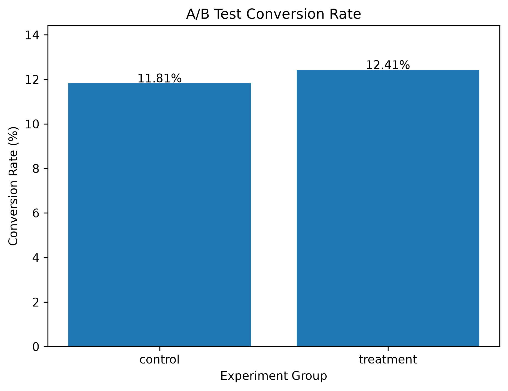
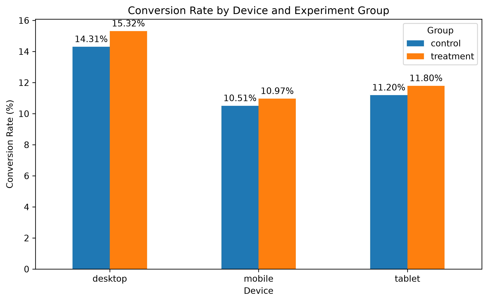
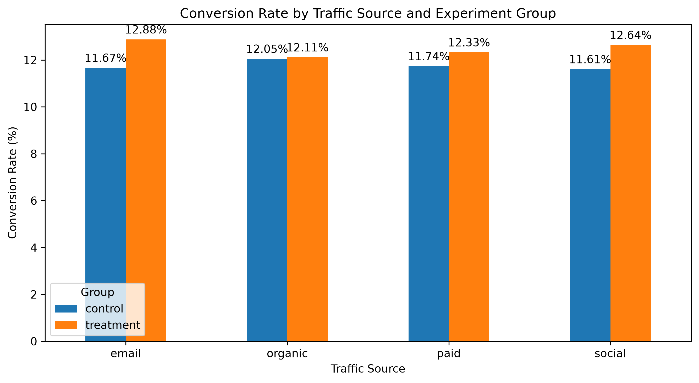

# A/B Testing & Product Analytics

An end-to-end product analytics project evaluating the impact of a simulated product experiment on user conversion.

## Live Dashboard

[Open the interactive Streamlit dashboard](https://jay-ab-testing-analytics.streamlit.app/)

## Project Overview

This project analyzes an A/B test involving 50,000 users split between a control and treatment group.

The analysis evaluates whether the treatment improves conversion performance and explores how experiment results vary across device types and traffic sources.

## Tools & Technologies

- Python
- Pandas
- NumPy
- Statistical Hypothesis Testing
- A/B Testing
- Matplotlib
- Streamlit
- Jupyter Notebook

## Key Analysis

- Conversion rate analysis
- Absolute and relative lift
- Two-proportion Z-testing
- 95% confidence intervals
- Statistical power and sample-size analysis
- Device segmentation
- Traffic-source segmentation
- Multiple-testing correction
- Interactive Streamlit dashboard

## Experiment Results

| Metric | Result |
|---|---:|
| Total Users | 50,000 |
| Control Conversion Rate | 11.81% |
| Treatment Conversion Rate | 12.41% |
| Absolute Lift | +0.60 percentage points |
| Relative Lift | +5.07% |
| P-value | 0.0200 |
| 95% Confidence Interval | +0.03 to +1.17 percentage points |

The treatment produced a higher overall conversion rate than the control. The one-sided hypothesis test returned a p-value below the 0.05 significance threshold, providing statistical evidence of a positive treatment effect in this simulated experiment.

## Key Findings

- Treatment conversion increased from **11.81% to 12.41%**.
- The treatment produced a **5.07% relative lift** in conversion.
- Desktop users showed a statistically significant positive difference in the device-level analysis.
- Email traffic showed a statistically significant positive difference in the traffic-source analysis.
- Combined segment testing demonstrated the importance of correcting for multiple comparisons.
- After Bonferroni correction, none of the 12 combined device and traffic-source segments remained statistically significant.

## Business Recommendation

The overall experiment supports considering a broader rollout of the treatment while continuing to monitor conversion performance. Segment-level findings should be treated cautiously, particularly when analyzing many customer segments simultaneously.
## Visualizations

### Overall Conversion Rate

### Conversion Rate by Device

### Conversion Rate by Traffic Source

